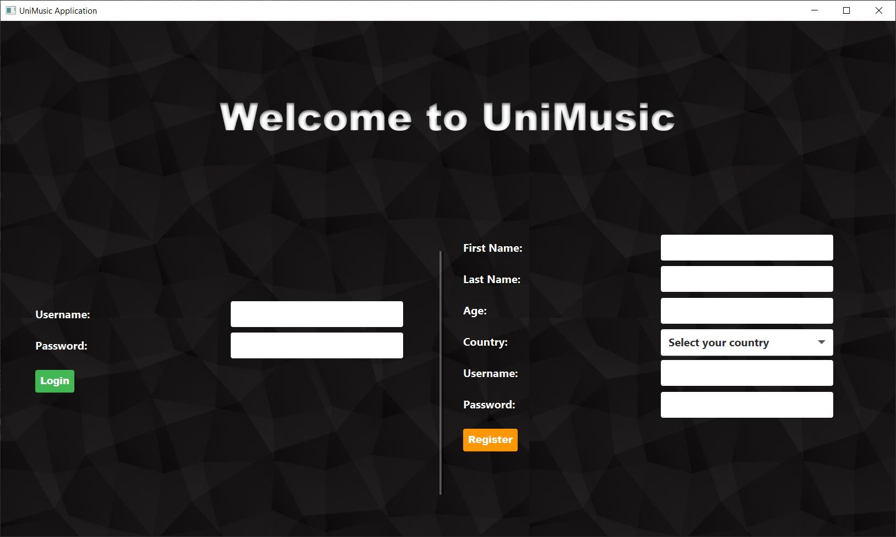
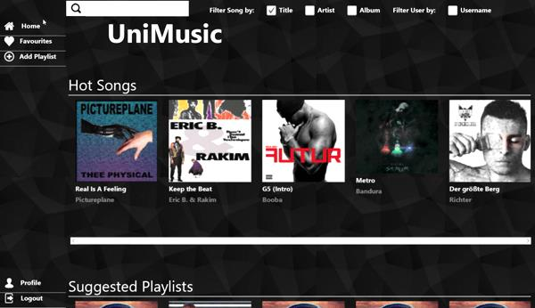
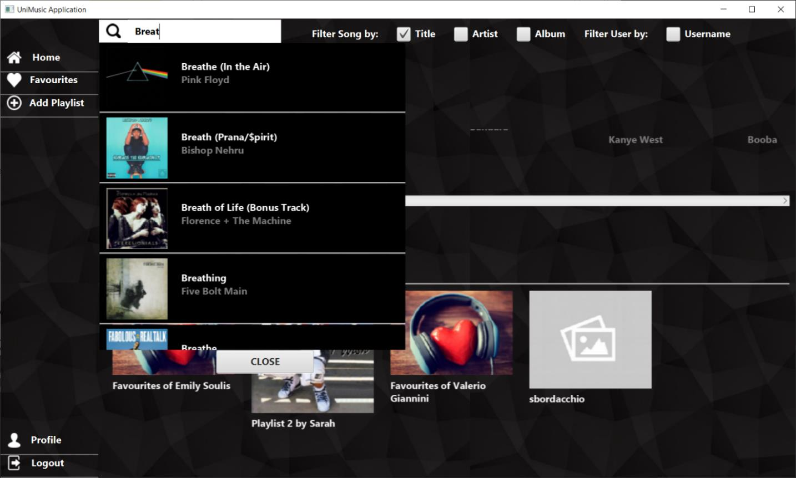
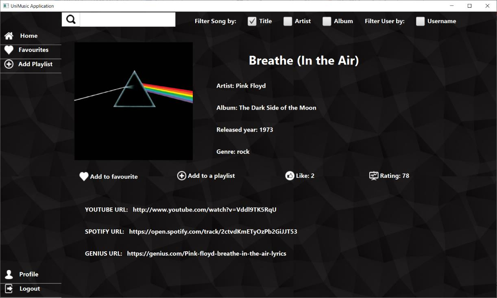
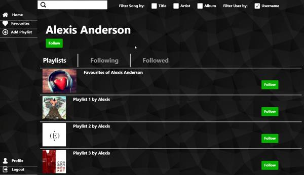
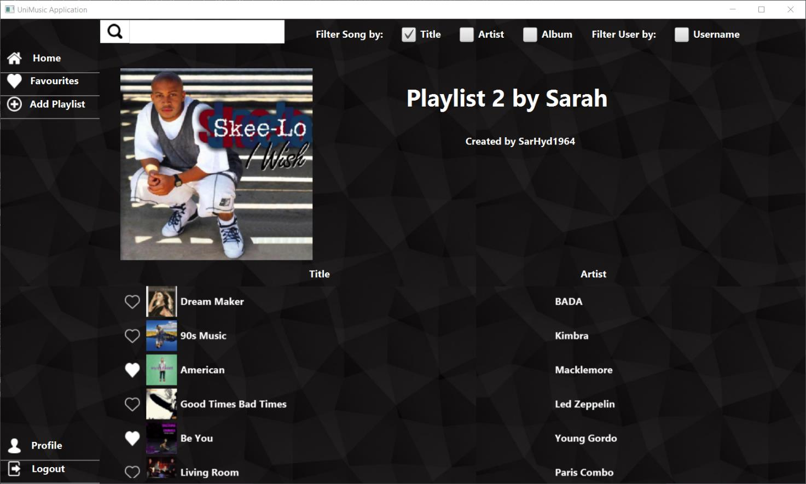
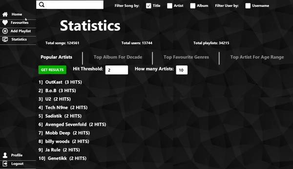

# UniMusic 

## Introduction
<b>UniMusic</b> is an application that aims to simplify and enhance the **song discovery and management experience** for its users. The main feature of the platform is the song search and management service, where users can find and access official sources of songs on the internet, such as YouTube and Spotify, through links provided by the application.

Users can search and browse the songs in the platform's database by applying specific filters, such as genre, artist, and song name. The application also provides general information about each song, such as its name, genre, and artist, making it easy for users to find the songs they are looking for.

Users can also express their opinions on the songs through a "like" system and possibly add them to their favorites list for easy access later. In addition, users can organize songs into playlists or follow other people's playlists to discover new songs and improve the listening experience.

The platform also allows users to follow other users, in order to get suggestions on songs and playlists that align with your taste. With UniMusic, users can easily discover new music, express their preferences, and organize their songs, all in one place.

Please, check the [Documentation](Documentation.pdf) for a complete view. 

## Software Architecture
The application has been divided into two-tiers according to the Client-Server paradigm, exploiting Java as the core programming language.

### Client Side
The client side is divided into:
- A Front-End module, in charge of
  - providing a GUI based on JavaFX for users to interact with the application.
  - communicating with the underlying middleware to retrieve information obtained by processing data stored on server side.
- A Middleware module, which communicates with the server side. It includes the logic used to communicate with the MongoDB cluster and the Neo4j database on the server, plus all the logic needed to handle and process data retrieved so that it can be used by the front end to present it to users.

### Server Side
Server composed of 3 virtual machines which hosts a MongoDB cluster and a single instance of the
Neo4j database.

  

## Dataset Organization and Database Population
The application dataset is manly composed by songs’ information, that are the core of our application.
Firstly, we have obtained almost all the information using services offered by [GENIUS](https://www.genius.com), that permits to scrape their content through HTTP-based API.
It returns a raw json document for each song requested; we then filter all information needed, in particular also 2 URLs and a URI that are used to scrape remaining information:
- using the Genius URL to the specific song page, we scrape the attribute “genre” that is not provided through API.
- using the Spotify URI, we have requested, through Spotify API, the song’s popularity.
- using the YouTube URL to the official video of the song we scrape the number of Like and Dislike.
The last two information have been used to create our “popularity” attribute as an aggregation of Spotify popularity and YouTube Like/Dislike ratio using this formula:
<i>0.7 * SpotifyPopularity + YouTubeRatio * 0.3.</i>

Here we have a summary of how the two databases are populated:

  

## User Manual

### Login and registration
Once the application is started, the first screen shown to the user contains the forms to **log in** and to **register a new account**.
If a user accesses the application for the first time, he needs to register a new standard user
account using the form on the right. After that, he can insert his credential on the left to log in.

  

### Home page
For a standard user, the homepage is the following:

  

**Side bar**
On the left there is a **side bar** (equal for every screen of the application), used by the user to:
* visualize its homepage (Home).
* visualize its playlist of favourite songs (Favourites).
* add a new playlist (Add Playlist).
* access to his own profile (Profile).
* log out and return to the login page (Logout).
**Body**
At the centre of the page there are shown:
* **hot songs**, i.e. the songs which received more like in the last month.
* **suggested playlists**, i.e. the playlist followed by our followed user or by the user followed by them.
* **suggested users**, i.e. users followed by our followed users and users which like the same songs as
us.

### Search bar
At the top of the screen there is a search bar (also the same for all screens) where the user can search for
**songs or users**.
The type of search is differentiated by the use of the **checkboxes**, the user has to insert the title of the
song, the name of the artist or the name of the album to find songs depending on which box is checked
between Title, Artist or Album, otherwise he can search for other users ticking the checkbox Username.

  

### Song page
The page of a song contains his information, buttons to add the song to favourites, to add song to a playlist
and to like the song.
It is also shown a rating, based on the popularity on Spotify and the number of like and dislike on YouTube.
Below there are the links to YouTube, Spotify and Genius, and by clicking on them the user can listen the
song or view its video on his browser.

  

### User Page
The page of a user gives the possibility to follow him, to see his playlists and follow them, and to see and
follow the follower and the followed user of that profile. If the user shown correspond to the logged user,
he has the possibility to the delete his own profile.

  

### Playlist Page
The playlist page shows the information of the playlist and all the songs it contains, and it gives the
possibility to like them and to reach the correspondent song page. If the playlist is created by the logged
user, he has the possibility to delete it.

  

### Admin
If the credentials inserted in the login form are associated to an Administrator account, the user can access
to some extra functionalities of the application.
The sidebar of an administrator gives also the possibility to access to the statistics of the application.
More over if an admin goes to a user page, he has the possibility to delete his account and to update his privilege level
to the Administrator level.

From the statistics page the admin can:
* Check the number of users, songs and playlists saved in the database.
* View the artists which made the higher number of hits (songs that received more than Hit Threshold likes, which is a customizable parameter for the admin).
* View the most rated albums for every decades.
* View the most present genres in playlists.
* View the favourite artists for every age range.

  

